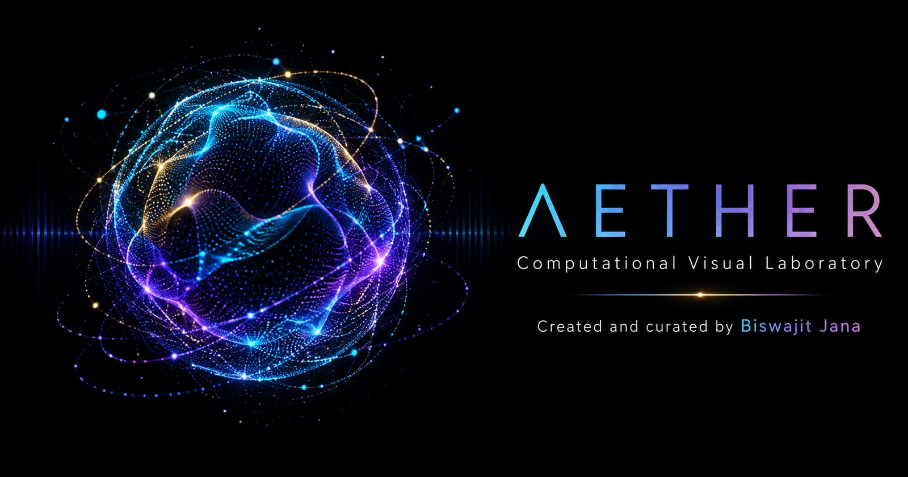

<p align="center">
  
</p>

<h1 align="center">A E T H E R</h1>
<p align="center"><strong>Computational Visual Laboratory</strong></p>
<p align="center">Created and curated by Biswajit Jana</p>

<p align="center">
  <a href="https://biswajit1999.github.io/AETHER/"><strong>ENTER THE LIVE LABORATORY ↗</strong></a>
</p>

<p align="center">
  
  
  
  
</p>

---

## A laboratory for learning through motion

AETHER is my personal place for learning, experimenting and developing computational visual art. I study how mathematics, physics, sound and code can become living visual experiences—forms that can be observed, rotated, heard, tested and refined in real time.

This is not a single finished artwork. It is a growing catalogue of investigations: particle systems, galactic encounters, mathematical structures, emergent motion, generative shaders and audiovisual compositions. Each study is a record of curiosity becoming form.

## The mission

> To build distinctive interactive animations that unite visual beauty with mathematical structure, physical meaning and careful craft.

The laboratory develops along four connected paths:

| OBSERVE | MODEL | TEST | REFINE |
|:--|:--|:--|:--|
| Find a phenomenon, structure or motion worth understanding. | Translate the idea into rules, geometry and measurable parameters. | Examine behaviour, performance and limitations across devices. | Improve composition, interaction, clarity and scientific honesty. |

## Explore the collection

The live gallery provides a cinematic WebGL stage, procedural catalogue previews, camera interaction, visual controls, audio response, local music playback and contextual notes for documented models.

- **Astrophysical studies** — galaxy encounters, stellar systems, orbital structures and explosive events
- **Mathematical studies** — topology, parametric surfaces, wave fields, chaos and higher-dimensional geometry
- **Particle studies** — flow, attraction, emergence, turbulence and collective motion
- **Audiovisual studies** — animation driven by frequency, amplitude, rhythm and onset

## Scientific clarity

AETHER separates three kinds of work instead of treating every beautiful image as a scientific simulation:

| Classification | Meaning |
|:--|:--|
| **Physics model** | Evolves from documented physical assumptions, numerical methods, units and stated limitations. |
| **Mathematical construction** | Generated from an explicit equation, topology or deterministic geometric rule. |
| **Visual study** | An artistic exploration inspired by a phenomenon; it does not claim predictive physical accuracy. |

The catalogue is being reviewed one study at a time. Model notes and references are added only where the implementation supports them.

The generated [Study Atlas](./STUDY_ATLAS.md) audits the complete catalogue. It records each study's classification, runtime path, shader coverage, tags, metadata checksums and contract status. The machine-readable report is published at [`public/study-contract-report.json`](./public/study-contract-report.json).

## Learn Three.js with AETHER

The [AETHER Field Guide to Three.js](https://biswajit1999.github.io/AETHER/tutorial/) is a free ten-chapter path from the first scene to production-ready particle and shader work. It covers the rendering loop, project structure, geometry, cameras, motion, interaction, GPU particles, GLSL, audio response, performance, testing and a complete equation-driven capstone study.

The guide is written as a practical companion to the laboratory and is created and curated by Biswajit Jana.

## Equation collection

Ten new studies integrate or iterate their stated systems directly: Rössler flow, Duffing dynamics, Chua's double scroll, the Hénon–Heiles Hamiltonian, double-pendulum motion, the Ikeda optical map, Hénon's map, Lorenz–96, Thomas's cyclic labyrinth and Kuramoto synchronisation. Every entry publishes its equation, numerical method, reference and limitation in the interface; its thumbnail is generated from the same model trajectory.

## Featured model — Andromeda–Milky Way Encounter

The first deeper scientific revision replaces a static galaxy-shaped particle field with a time-evolving restricted N-body encounter. Two mutually interacting softened galactic potentials guide massless stellar tracers through close approaches, bridges, shells and tidal tails. The model exposes its integration method, units, assumptions and limitations directly in the interface.

It is an educational merger-compatible realisation—not a precision forecast of the Local Group’s future.

## Built for real-time exploration

```text
Three.js · WebGL · GLSL · Web Audio API
Deterministic seeds · Lazy-loaded studies · Responsive controls
Procedural previews · Reproducible rendering · Automated catalogue checks
```

## Run the laboratory locally

```bash
git clone https://github.com/Biswajit1999/AETHER.git
cd AETHER
npm install
npm run dev
```

Production verification:

```bash
npm test
npm run manifest
npm run build
```

## Direction

AETHER will continue to grow through deeper simulation models, better numerical validation, more expressive shaders, original sound-responsive systems and carefully composed interactive experiences for both desktop and mobile.

Every new piece should answer two questions:

1. What is the system doing?
2. Why does its motion matter?

## Copyright and use

**© 2026 Biswajit Jana. All rights reserved.**

The original AETHER source code, visual designs, simulations, written material, branding and project assets may not be copied, redistributed, republished, sold, modified or incorporated into another project without prior written permission from Biswajit Jana. Third-party libraries and music remain governed by their respective licences and notices.

Viewing the public website does not grant a licence to reuse its original material. See [RIGHTS.md](./RIGHTS.md) and [THIRD_PARTY_NOTICES.md](./THIRD_PARTY_NOTICES.md) for details.

---

<p align="center"><strong>AETHER</strong><br />Computational Visual Laboratory<br /><sub>Created and curated by Biswajit Jana</sub></p>
